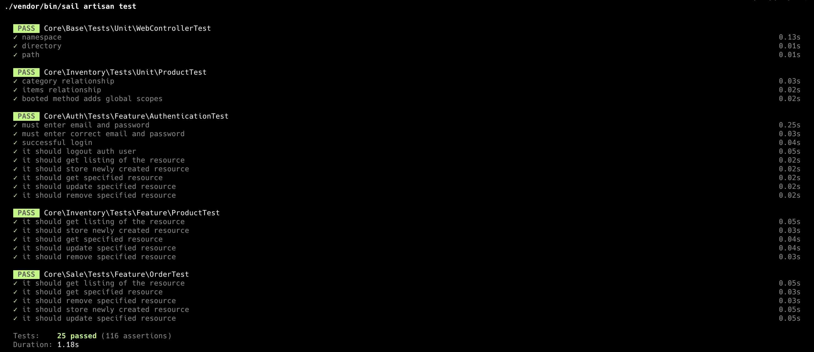

### Intro:
The app is built on Laravel and [Laragine](https://github.com/yepwoo/laragine)

### Getting started:
* You do not have a `.env` file in the project root directory so copy `.env.example` and save it as `.env`
* In `.env` file update the database info
* Open the terminal and navigate to the project directory and run `composer update`
* Generate the application key using `php artisan key:generate`
* Create the database tables and seed them by running `artisan migrate:refresh --seed`
* enjoy 😃 !

### API Docs:
for the API docs, you can find it [here](https://documenter.getpostman.com/view/6359426/2sAXxWaV54).

### Notes:
* You can run the app using docker `./vendor/bin/sail up` and then you can use `artisan` commands like this: `./vendor/bin/sail artisan ...`
* You can run the tests by running `php artisan test` and a result like below will be displayed:

### If I would to spend more time on the project, what Would I do:
* Make the caching mechanism for the products much smarter.
* Handle failures scenarios like what if there is a problem happened when creating the order (in OrderObserver)?
* Horizental scaling of App & DB